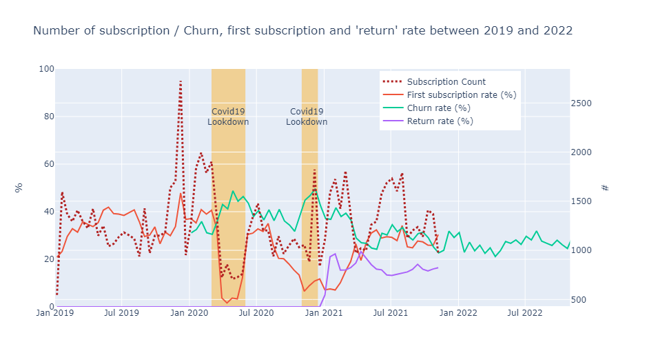
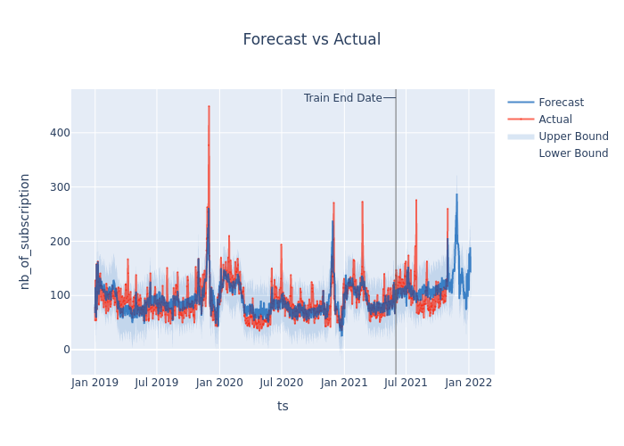
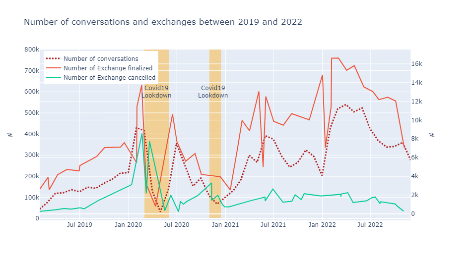
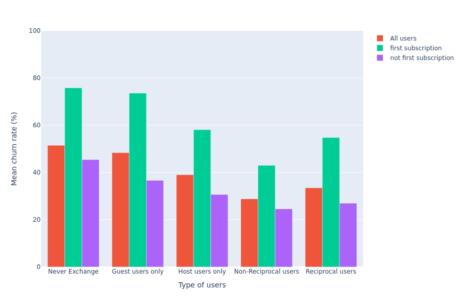

# Home Exchange (Final Project of Le Wagon's Bootcamp)

HomeExchange is a popular alternative to Airbnb that enables house swapping. The registration process is free, and users only pay the annual membership fee of €160 when they find their first exchange.

HomeExchange want to understand the reasons behind customer churn. Various variables, such as user seniority, activity as a guest or host, sponsorship, and subscriptions obtained through promotions, are available to determine their impact on the churn rate.

## Tools used 

  - SQL : to load, clean and enrichment of the data
  - Web Scrapping (Python) : to extract rating score on TrustPilot
  - Python : to explore, visualize and draw analysis conclusions based on the data
  - Machine Learning (Python) :
      - Classification
      - Time series prediction

## Project organization 

 - The "sql_dbt_snapshot" include a static copy of SQL code done on dbt to clean the datasets. 
 - The "notebook" repository showcases data analysis and predictions for HomeExchange, including:
     - Analysis of Churn: Static visualization (charts in PNG format) or interactive notebooks (viewable [here](https://nbviewer.org/github/ctherreau/HomeExchange/blob/main/notebook/AnalysisChurn_interactive.ipynb)).
     - Web Scraping: Extracting data from Trustpilot to track the evolution of HomeExchange's rating score.
     - Churn Prediction: Utilizing classification algorithms to forecast which users are likely to unsubscribe from the platform.
     - Subscription Prediction : Time Series prediction using Prophet aglorithm. 

 - You can find a quick presentation of the analysis results in the "DemoDay.pdf" that was use for the "DemoDay" at the end of Le Wagon's bootcamp. 

## Main results 

<table>
  <tr>
    <td>   </td>
    <td>   </td>
  </tr> 
  <tr>
    <td>  </td>
    <td> </td>
   </tr> 
</table>

## Recommendations

To optimize user engagement and improve the HomeExchange platform, the following strategies can be implemented:

   - **Identify highly active users to serve as ambassadors**
       - Enhance user profiles by including social media information.
       - Utilize ambassadors to promote the platform and engage with the community.
       - Recognize and reward users who successfully refer a significant number of new users.
   - **Enhancing Exchanges (via GP or reciprocal):**
     - Encourage users to become hosts by offering them additional rewards when they become hosts for the first time
     - Increase the visibility of hosts users by adding a badge to their profiles, attracting attention from new subscribers.
   - **Motivating Users with Limited Engagement:**
       - Identify users with a small number of conversations or exchanges.
       - Reach out to them via email, providing tips and recommendations to help them find exchanges.
       - Suggestions may include improving the quality of house pictures or descriptions, receiving alerts when their city is highly searched on the website, and more.
   - **Surveying Non-Exchanging Users:**
       - If a user's subscription is nearly expired and they have not engaged in any exchanges, conduct a survey to understand their reasons.
       - Analyze the collected data to gain insights into the challenges faced by users in finding suitable exchanges and determine potential areas for improvement.

By implementing these strategies, HomeExchange can foster a thriving community, increase user engagement, and provide a better user experience for both existing and new subscribers.

